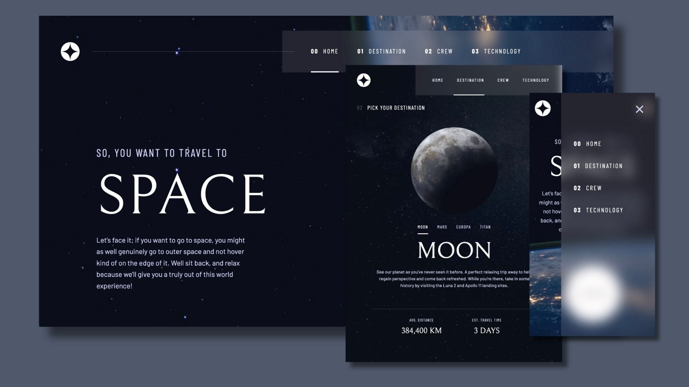

# Beyond Horizon Tours

## Table of contents

- [Overview](#overview)
  - [Introduction](#introduciton)
  - [Screenshot](#screenshot)
  - [Links](#links)
- [My process](#my-process)
  - [Built with](#built-with)
  - [What I learned](#what-i-learned)
  - [Continued development](#continued-development)

## Overview

### Introduction

This is a solution to the [Space tourism website challenge on Frontend Mentor](https://www.frontendmentor.io/challenges/space-tourism-multipage-website-gRWj1URZ3).
This project exposes various challenges that need to be addressed to provide a seamless experience for the users, from how to smoothly transition between content when a user clicks on a tab, to reducing the image loading time for a better site performance.



### Links

- [Source code](https://github.com/charmainelhm/beyond-horizon-tours)
- [Live site](https://beyondhorizon-tours.vercel.app/)

## My process

### Built with

- [React](https://reactjs.org/) - JS library
- [Next.js](https://nextjs.org/) - React framework
- [Tailwind CSS](https://tailwindcss.com/) - For styles
- [Framer Motion](https://www.framer.com/motion/) - For smooth transitioning of react states
- [Embla Carousel](https://www.embla-carousel.com/) - For smooth swiping motion when changing between content

<!-- ### What I learned

Use this section to recap over some of your major learnings while working through this project. Writing these out and providing code samples of areas you want to highlight is a great way to reinforce your own knowledge.

To see how you can add code snippets, see below:

```html
<h1>Some HTML code I'm proud of</h1>
```

```css
.proud-of-this-css {
  color: papayawhip;
}
```

```js
const proudOfThisFunc = () => {
  console.log("🎉");
};
```

If you want more help with writing markdown, we'd recommend checking out [The Markdown Guide](https://www.markdownguide.org/) to learn more.

**Note: Delete this note and the content within this section and replace with your own learnings.**

### Continued development

Use this section to outline areas that you want to continue focusing on in future projects. These could be concepts you're still not completely comfortable with or techniques you found useful that you want to refine and perfect. -->
